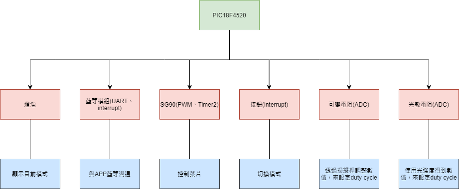

## a. 系統功能與原理說明
此百葉窗系統可以分成三個模式，分別為手調模式、藍芽模式與光控模式，以下一一說明原理
### 操作端說明(無使用藍芽)
* 手調模式 : 使用可變電阻模擬百葉的操控桿，透過電壓的改變去改變SG90伺服馬達的duty cycle以控制葉片的角度
* 光控模式 : 使用光敏電阻，光敏電阻值受到光強度大小影響，來改變SG90伺服馬達的duty cycle以控制葉片的角度。
* 模式切換與顯示 : 透過按鈕觸發interrupt來改變模式，而使用三個燈泡來顯示目前的狀態。
### 操作端說明(使用藍芽)
* 藍芽模式 : 透過手機app與HC-05之間的訊號傳輸，依據傳送的數值大小(1~6)，控制葉片的角度。
* 模式切換與顯示 : 透過藍芽傳送模式改變模式，可在三個模式間自由切換。
* 更新數值 : 取得目前狀態
## b. 系統使用環境與對象
此系統可在任何居家環境使用，如同市面上的百葉窗，適用對象為受到光線強度太而影響到工作或生活的人。
## c. 系統完整架構圖、流程圖、電路圖、設計
### 系統完整架構圖 
 
<br>
<br>
<br>
<br>

### 流程圖 
 
### 電路圖 
  
### 設計-百葉窗
 </img>
<br>
<br>

### 設計-APP
 </img>
 </img>
<br>
<br>
<br>

## d. 系統開發工具、材料及技術
* 開發工具 : Android Studio、MPLAB X IDE
* 材料 : PIC18F4520晶片、光敏電阻、可變電阻、SG90伺服馬達x3、HC-05藍芽模組、燈泡x3、TTL線x1、按鈕x1、公對公杜邦線xN、公對母杜邦線xN、電阻xN(其中至少需三個電阻其電阻值為1k歐姆)、紙板、筷子xN、塑膠板xN、雙面膠、膠帶、小箱子、樂高輪胎x3。
* 技術 :  Interrupt(模式切換與UART)、Timer(輔助PWM)、PWM(SG90馬達控制)、UART(藍芽傳輸)、ADC(操縱桿與光敏電阻轉換)
## e.周邊接口或 Library 及 API 使用說明
### 周邊街口
* HC-05藍芽模組 : 在本次作品使用到RXD、TXD、GND、VCC四個角位，其中RXD接到PIC18的TX，TXD接到PIC18的RX。
### PIC18F4520端 library 及 API 使用說明
* Library : XC8.h、string.h、stdio.h、stdlib.h、adc.h、ccp1.h、interrupt_manager.h、pin_manager.h、setting.h、tmr2.h、uart.h、pic18f4520.h
* API :  
```
  void ADC_Initialize() :  初始設定ADC
  int ADC_Read(int channel) : 透過回傳ADC在channel的pin的轉換結果
  void CCP1_Initialize() : 初始設定CCP1
  int CCP1_Setdutybyanalog(int value) : 透過value值改變duty cycle，value值為(0~1023)
  void CCP1_Setdutybyuart(int segment) : 透過segment改變葉片段數，segment值為(0~5)
  void INTERRUPT_Initialize(void) : 開啟interrupt功能
  void PIN_MANAGER_Initialize(): 設定LED腳位
  void PIN_MANAGER_Sethandlight() : 將手持模式燈打開，其他模式關閉
  void  PIN_MANAGER_Setbtlight() : 將藍芽模式燈打開，其他模式關閉
  void PIN_MANAGER_Setlightlight() : 將光控模式燈打開，其他模式關閉
  void TMR2_Initialize() : 初始設定Timer2
  void SYSTEM_Initialize(void) : 將系統做設定，呼叫所有Initialize結尾的API
  void OSCILLATOR_Initialize(void) : 設定Oscillator頻率
  void UART_Initialize(void) : 初始設定UART
  char * GetString() : 得到目前在buffer裡的string
  void UART_Write(unsigned char data) : 寫一個字元給外部接收端
  void UART_Write_Text(char* text) : 傳送字串給外部接收端
  void ClearBuffer() : 將buffer清空
  void MyusartRead() : 若接受到數據，放進buffer中
  int GetLen() : 取得目前buffer長度(不包含'\0')
```

<br> 

## f. 作品操作之 Demo 影片

https://youtu.be/BiyrC8-uOek
